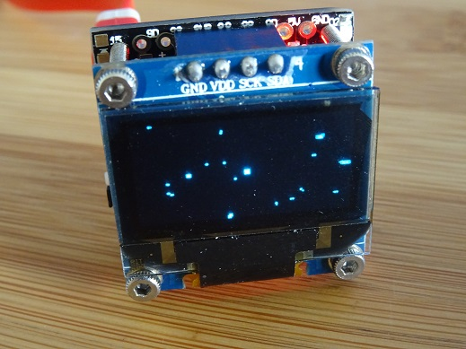
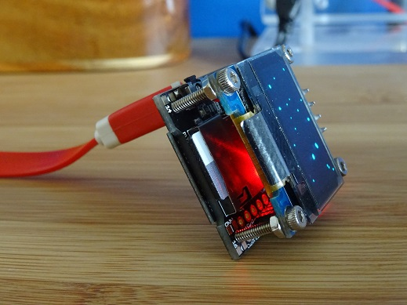
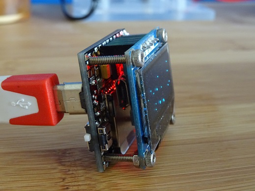

# oled-starfield
This is a Starfield simulation for arduino/esp8266 with an SSD1306 OLED display. 

When running it looks a little like the classic Widows 98 era starfield screen saver, 
here is a short video:

https://youtu.be/OiCOoXXp9ss

The code should work on any Ardunio or ESP8266 with an I2C SSD1306 OLED.

I am using a little cube board with an ESP12E that I found on Tindie.

## The OLEDiESP

These are made by Hayri, a talented engineer, with a store on Tindie - 
[Phoenix Cnc, Olediuno Store](https://www.tindie.com/stores/PhoenixCNC/).

This is what the cube looks like:

This is really neat litle cube shaped board which includes a microSD card reader, 
the WiFi enabled ESP8266 chip and a 0.96" blue OLED display. 

In the picture below you can see the microSD protruding from the slot. I like this SD slot because it
is a push to release type slot so there is less chance of it being dislodged by mistake.

On the other side of the cube there is a slide switch which puts the cube into a
programmable mode so that code can be uploaded. 

The slide switch and reset button are shown in the next picture.

The Arduino software worked straight away and I was able to upload code without any issues. I just used a
generic ESP8266 board as the board choice.

 

There is a blue LED on the top right hand corner of the board which indicates 
when the board is in programming mode.

There are many other features on this board to you can see the [full details at Hayri's shop.](https://www.tindie.com/products/PhoenixCNC/olediesp-a-tiny-cube-with-esp07--esp12--oled-iot/)
 
This second picture also shows another feature that I really like - the second
micro USB port at the back of the cube. This direction of this port makes it a very
tidy place to power the cube. 
